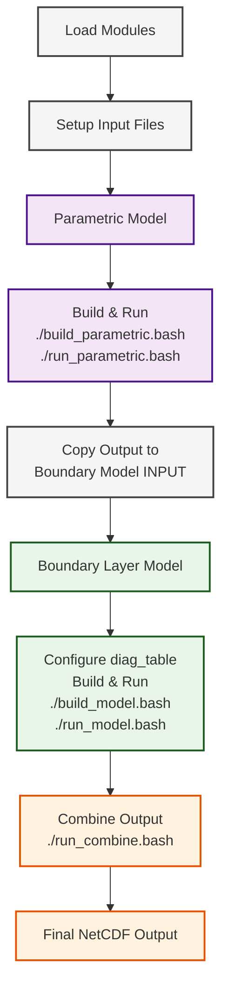

# URI Hurricane Boundary Layer Wind Model (URI-HBL)
## Overview

The URI Hurricane Boundary Layer Wind Model (URI-HBL) is a high-resolution, three-dimensional numerical model developed at the University of Rhode Island to simulate boundary layer winds in hurricanes, driven by a prescribed upper-level vortex in gradient balance and motion-induced forcing. This branch implements the idealized, axisymmetric hurricane simulation framework developed in:

**Jisan, Mansur Ali.** *Development and Application of a Hurricane Boundary Layer Wind Model for Landfalling Hurricanes*. University of Rhode Island, 2024. https://doi.org/10.23860/diss-1640

The model consists of two main components: a parametric wind field generator that generates the initial and boundary conditions, and a 3D boundary layer model that simulates the wind field, including the surface and boundary layers of the hurricane. 

## Model Features and Applications

This idealized hurricane simulation branch is specifically designed for:

- **Landfall Studies**: Detailed analysis of hurricane boundary layer structure during landfall events
- **Hurricane-Land Interaction**: Investigation of wind field changes due to the roughness contrast between land and sea.
- **Idealized Experiments**: Controlled studies of hurricane boundary layer evolution due to the effect of land surface roughness.


## Directory Structure

```
URI-HBL/
├── boundary_home/           # Source code and shared libraries
│   ├── source/
│   │   ├── parametric/      # Parametric model source
│   │   ├── model/           # Boundary layer model source
│   │   ├── shared/          # Shared modules and utilities
│   │   └── post_process/    # Post-processing tools
│   ├── LIBS/                # External libraries (mppnccombine, etc.)
│   └── inputs/              # Static input data files
├── boundary_parametric/     # Parametric model experiments
│   └── IDEAL/exps/1KM/      # 1km resolution setup
└── boundary_model/          # Boundary layer model experiments
    └── IDEAL/exps/1KM/      # 1km resolution setup
```

## Prerequisites

### Required Modules
Load the following modules before building and running the model:

```bash
module load spack-managed-icelake/v1.0
module load intel-oneapi-compilers/2024.2.1
module load intel-oneapi-mpi/2021.13.1
module load hdf5/1.14.3
module load netcdf-c/4.9.2
module load netcdf-fortran/4.6.1
```

### System Requirements
- Intel Fortran compiler
- Intel MPI
- NetCDF libraries (C and Fortran)
- HDF5 library

## Quick Start Guide

### Step 1: Parametric Model Setup and Execution

1. **Navigate to the parametric model directory:**
   ```bash
   cd boundary_parametric/IDEAL/exps/1KM/
   ```

2. **Configure the model:**
   - Edit `time_mod.F90` in the `GRIDS/` directory to set up model grid and time parameters
   - Prepare track file in the `INPUT/` directory (e.g., `track_file_control`, `track_file_z50fast`, `track_file_z50slow`)
   - Configure `input.nml` namelist file with appropriate settings
   - Ensure `topog_storm_domain.nc` (land-sea mask) is present in `INPUT/`

3. **Build the parametric model:**
   ```bash
   ./build_parametric.bash
   ```

4. **Run the parametric model:**
   ```bash
   ./run_parametric.bash
   ```
   Note: The parametric model runs in serial mode.

### Step 2: Boundary Layer Model Setup and Execution

1. **Copy parametric output:**
   Copy the parametric model output file to the boundary layer model input directory:
   ```bash
   cp boundary_parametric/IDEAL/exps/1KM/OUTPUT/[parametric_output_file] \
      boundary_model/IDEAL/exps/1KM/INPUT/
   ```

2. **Navigate to the boundary layer model directory:**
   ```bash
   cd boundary_model/IDEAL/exps/1KM/
   ```

3. **Configure the model:**
   - Update `input.nml` to specify the parametric output filename
   - Configure `diag_table` to control output variables:
     - For 2D wind fields: include `ubot`, `vbot`
     - For 3D wind fields: include `um`, `vm`
     - See `diag_table_all` for complete list of available output parameters

4. **Build the boundary layer model:**
   ```bash
   ./build_model.bash
   ```

5. **Run the boundary layer model:**
   ```bash
   ./run_model.bash
   ```
   Note: The boundary layer model uses MPI parallelization. The domain decomposition is configured in `grid_mod.F90`.

### Step 3: Post-Processing

The boundary layer model outputs separate NetCDF files for each MPI rank. To combine these into a single file:

```bash
./run_combine.bash
```

This script uses `mppnccombine` to merge all individual NetCDF files into a single output file.

## Configuration Files

### Key Configuration Files

1. **`time_mod.F90`**: Model grid and time step configuration
2. **`input.nml`**: Runtime namelist parameters
3. **`diag_table`**: Output variable selection
4. **`grid_mod.F90`**: Domain decomposition for MPI

### Important Input Files

1. **Track files**: Hurricane track data (in `INPUT/` directory)
2. **`topog_storm_domain.nc`**: Land-sea mask data (in `INPUT/` directory).
   - [Download `topog_storm_domain.nc`](https://drive.google.com/file/d/1Rws1owyZmNuS2us9MnDS0MDEXOlxqRKG/view?usp=drive_link)

## Output Variables

### Available Diagnostics (from `diag_table_all`):
- **2D Variables**: `ubot`, `vbot`, `utop`, `vtop`, `pgfx`, `pgfy`, `mask`, `znot`, `rain_acc`
- **3D Variables**: `um`, `vm`, `umdt`, `vmdt`, `dudx`, `dudy`, `dudz`, `dvdx`, `dvdy`, `dvdz`, `wm`, `tur`
- **Temporal Variables**: `wsmax`, `xy_center`, `xy_corner`

### Common Output Configurations:
- **2D Wind Analysis**: Include `ubot`, `vbot`, `utop`, `vtop`
- **3D Wind Analysis**: Include `um`, `vm`, `wm`
- **Surface Analysis**: Include `mask`, `znot`, `pgfx`, `pgfy`


## Example Workflow

```bash
# 1. Load modules
module load spack-managed-icelake/v1.0
module load intel-oneapi-compilers/2024.2.1
module load intel-oneapi-mpi/2021.13.1
module load hdf5/1.14.3
module load netcdf-c/4.9.2
module load netcdf-fortran/4.6.1

# 2. Run parametric model
cd boundary_parametric/IDEAL/exps/1KM/
./build_parametric.bash
./run_parametric.bash

# 3. Transfer output and run boundary model
cp OUTPUT/parametric_output.nc ../../../boundary_model/IDEAL/exps/1KM/INPUT/
cd ../../../boundary_model/IDEAL/exps/1KM/
./build_model.bash
./run_model.bash

# 4. Combine output files
./run_combine.bash
```
## Workflow



## References and Citation

**Jisan, Mansur Ali.** *Development and Application of a Hurricane Boundary Layer Wind Model for Landfalling Hurricanes*. University of Rhode Island, 2024. https://doi.org/10.23860/diss-1640

